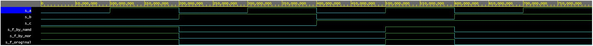

# DE1

## Lab-1

**Výsledné hodnoty**




**Source code**
```vhdl
architecture dataflow of gates is
begin
	
    f_original   <= (not(b_i) and a_i) or (not(c_i) and not(b_i));
	
    f_by_nand    <= (a_i nand not(b_i)) nand (not(c_i) nand not(b_i));
    f_by_nor     <= b_i nor (a_i nor not(c_i));

end architecture dataflow;
```


**Pravdivostná tabuľka**

| **c** | **b** |**a** | **f(c,b,a)** | **f(c,b,a)NAND** | **f(c,b,a)NOR** |
| :-: | :-: | :-: | :-: | :-: | :-: |
| 0 | 0 | 0 | 1 | 1 | 1 |
| 0 | 0 | 1 | 1 | 1 | 1 |
| 0 | 1 | 0 | 1 | 1 | 1 |
| 0 | 1 | 1 | 1 | 1 | 1 |
| 1 | 0 | 0 | 1 | 1 | 1 |
| 1 | 0 | 1 | 0 | 0 | 0 |
| 1 | 1 | 0 | 0 | 0 | 0 |
| 1 | 1 | 1 | 0 | 0 | 0 |


[EDA playground](https://www.edaplayground.com/x/jBKA)
