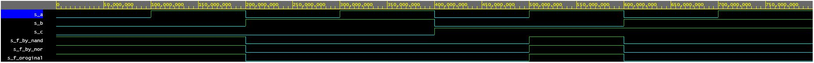
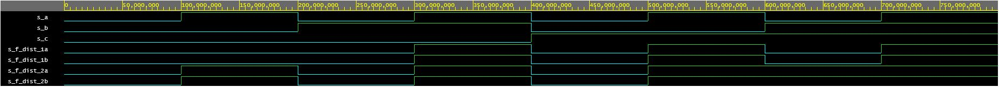

# Digital electronics 1 - 01 gates

## De Morgan´s laws

**Time waveforms**




**Source code**
```vhdl
architecture dataflow of gates is
begin
	
    f_original   <= (not(b_i) and a_i) or (not(c_i) and not(b_i));
	
    f_by_nand    <= (a_i nand not(b_i)) nand (not(c_i) nand not(b_i));
    f_by_nor     <= b_i nor (a_i nor not(c_i));

end architecture dataflow;
```


**Logical values tables**

| **c** | **b** |**a** | **f(c,b,a)** | **f(c,b,a)NAND** | **f(c,b,a)NOR** |
| :-: | :-: | :-: | :-: | :-: | :-: |
| 0 | 0 | 0 | 1 | 1 | 1 |
| 0 | 0 | 1 | 1 | 1 | 1 |
| 0 | 1 | 0 | 0 | 0 | 0 |
| 0 | 1 | 1 | 0 | 0 | 0 |
| 1 | 0 | 0 | 0 | 0 | 0 |
| 1 | 0 | 1 | 1 | 1 | 1 |
| 1 | 1 | 0 | 0 | 0 | 0 |
| 1 | 1 | 1 | 0 | 0 | 0 |


## Distributive laws

**Time waveforms**




**Source code**
```vhdl
architecture dataflow of gates is
begin
	
    f_dist_1a    <= (a_i and b_i) or (a_i and c_i);
    f_dist_1b	 <= a_i and (b_i or c_i);
    
    f_dist_2a	 <= (a_i or b_i) and (a_i or c_i);
    f_dist_2b	 <= a_i or (b_i and c_i);

end architecture dataflow;
```


**Logical values table**

| **c** | **b** |**a** | **f_1a(c,b,a)** | **f_1b(c,b,a)** | **f_2a(c,b,a)** | **f_2b(c,b,a)** |
| :-: | :-: | :-: | :-: | :-: | :-: | :-: |
| 0 | 0 | 0 | 0 | 0 | 0 | 0 |
| 0 | 0 | 1 | 0 | 0 | 1 | 1 |
| 0 | 1 | 0 | 0 | 0 | 0 | 0 |
| 0 | 1 | 1 | 1 | 1 | 1 | 1 |
| 1 | 0 | 0 | 0 | 0 | 0 | 0 |
| 1 | 0 | 1 | 1 | 1 | 1 | 1 |
| 1 | 1 | 0 | 0 | 0 | 1 | 1 |
| 1 | 1 | 1 | 1 | 1 | 1 | 1 |


<p align="center"> <a href="https://www.edaplayground.com/x/jBKA">EDA playground</a> </p>
<p align="center"> <a href="https://github.com/Jofadodo/Digital-electronics-1">GitHub repository</a> </p>