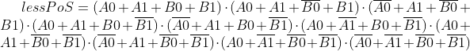

# Digital electronics 1 - 02 logic

## 2 - bit comparator


<br>

**Truth table**
| **Dec. equivalent** | **B[1:0]** | **A[1:0]** | **B is greater than A** | **B equals A** | **B is less than A** |
| :-: | :-: | :-: | :-: | :-: | :-: |
| 0 | 0 0 | 0 0 | 0 | 1 | 0 |
| 1 | 0 0 | 0 1 | 0 | 0 | 1 |
| 2 | 0 0 | 1 0 | 0 | 0 | 1 |
| 3 | 0 0 | 1 1 | 0 | 0 | 1 |
| 4 | 0 1 | 0 0 | 1 | 0 | 0 |
| 5 | 0 1 | 0 1 | 0 | 1 | 0 |
| 6 | 0 1 | 1 0 | 0 | 0 | 1 |
| 7 | 0 1 | 1 1 | 0 | 0 | 1 |
| 8 | 1 0 | 0 0 | 1 | 0 | 0 |
| 9 | 1 0 | 0 1 | 1 | 0 | 0 |
| 10 | 1 0 | 1 0 | 0 | 1 | 0 |
| 11 | 1 0 | 1 1 | 0 | 0 | 1 |
| 12 | 1 1 | 0 0 | 1 | 0 | 0 |
| 13 | 1 1 | 0 1 | 1 | 0 | 0 |
| 14 | 1 1 | 1 0 | 1 | 0 | 0 |
| 15 | 1 1 | 1 1 | 0 | 1 | 0 |

  

 

<br>

**Karnaugh maps**

  

<br>

  
  

<br>

  


**EDA output**
  


<p align="center"> <a href="https://www.edaplayground.com/x/P3vQ">EDA playground 2-bit</a> </p>


<br>
<br>
<br>
<br>

## 4 - bit comparator


<br>

**EDA output**
  

**Source code of architecture syntax**
```vhdl
architecture Behavioral of comparator_4bit is
begin

    B_greater_A_o   <= '1' when (b_i > a_i) else '0';
    B_equals_A_o    <= '1' when (b_i = a_i) else '0';
    B_less_A_o      <= '1' when (b_i < a_i) else '0';

end architecture Behavioral;
```
**Source code of testbench file**
```vhdl
p_stimulus : process
begin
    -- Report a note at the begining of stimulus process
    report "Stimulus process started" severity note;


    -- First test values
    s_b <= "0000"; s_a <= "0000"; wait for 100 ns;
    -- Expected output
    assert ((s_B_greater_A = '0') and (s_B_equals_A = '1') and (s_B_less_A = '0'))
    -- If false, then report an error
    report "Test failed for input combination: 00, 00" severity error;
    
    s_b <= "0000"; s_a <= "0001"; wait for 100 ns;
    -- Expected output
    assert ((s_B_greater_A = '0') and (s_B_equals_A = '0') and (s_B_less_A = '1'))
    -- If false, then report an error
    report "Test failed for input combination: 00, 01" severity error;
    
    s_b <= "0000"; s_a <= "0010"; wait for 100 ns;
    -- Expected output
    assert ((s_B_greater_A = '0') and (s_B_equals_A = '0') and (s_B_less_A = '1'))
    -- If false, then report an error
    report "Test failed for input combination: 00, 10" severity error;
    
    s_b <= "0000"; s_a <= "0011"; wait for 100 ns;
    -- Expected output
    assert ((s_B_greater_A = '0') and (s_B_equals_A = '0') and (s_B_less_A = '1'))
    -- If false, then report an error
    report "Test failed for input combination: 00, 11" severity error;
    


    -- Report a note at the end of stimulus process
    report "Stimulus process finished" severity note;
    wait;
end process p_stimulus;
```

**Listing of simulator console output**
```vhdl
[2021-02-22 13:30:05 EST] ghdl -i design.vhd testbench.vhd  && ghdl -m  tb_comparator_2bit && ghdl -r  tb_comparator_2bit   --vcd=dump.vcd && sed -i 's/^U/X/g; s/^-/X/g; s/^H/1/g; s/^L/0/g' dump.vcd 
analyze design.vhd
analyze testbench.vhd
elaborate tb_comparator_2bit
testbench.vhd:58:9:@0ms:(report note): Stimulus process started
testbench.vhd:118:9:@1us:(assertion error): Test failed for input combination: 0010, 1000
testbench.vhd:126:9:@1us:(report note): Stimulus process finished
Finding VCD file...
./dump.vcd
[2021-02-22 13:30:06 EST] Opening EPWave...
Done
```

<p align="center"> <a href="https://www.edaplayground.com/x/NKMz">EDA playground 4-bit</a> </p>

<br>
<br>
<hr>


<p align="center"> <a href="https://github.com/Jofadodo/Digital-electronics-1">GitHub repository</a> </p>