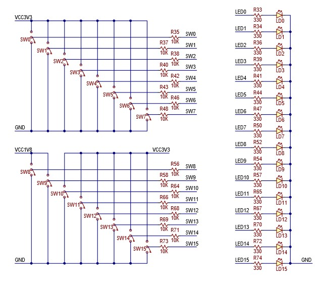
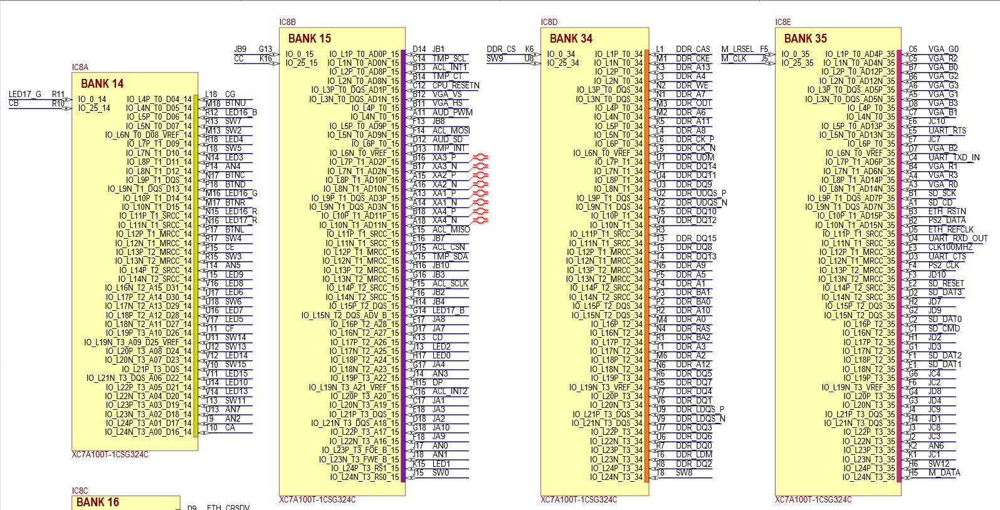
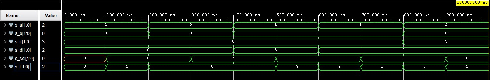

# Digital electronics 1 - 03 vivado

## Multiplexer 4-to-1

**Table with connections**

| **Connector** | **Pin** | **Program** |
| :-: | :-: | :-: |
| SW0 | J15 | a_i |
| SW1 | L16 | a_i |
| SW2 | M13 | b_i |
| SW3 | R15 | b_i |
| SW4 | R17 | c_i |
| SW5 | T18 | c_i |
| SW6 | U18 | d_i |
| SW7 | R13 | d_i |
| SW14 | U11 | sel_i |
| SW15 | V10 | sel_i |
| LED0 | H17 | f_o |
| LED1 | K15 | f_o |




<br>

**Source code of architecture syntax**
```vhdl
architecture Behavioral of mux_2bit_4to1 is
begin

    f_o <= a_i when (sel_i = "00") else 
           b_i when (sel_i = "01") else 
           c_i when (sel_i = "10") else 
           d_i;

end architecture Behavioral;
```

**Source code of testbench file**
```vhdl
p_stimulus : process
    begin
        -- Report a note at the begining of stimulus process
        report "Stimulus process started" severity note;


       
       
        s_d <= "00"; s_c <= "00"; s_b <= "00"; s_a <= "10"; wait for 100 ns;
        s_sel <= "00"; wait for 100 ns;
        
        s_d <= "00"; s_c <= "00"; s_b <= "11"; s_a <= "00"; wait for 100 ns;
        s_sel <= "10"; wait for 100 ns;
        s_d <= "11"; s_c <= "00"; s_b <= "01"; s_a <= "10"; wait for 100 ns;
        s_sel <= "11"; wait for 100 ns;
        s_d <= "10"; s_c <= "00"; s_b <= "01"; s_a <= "01"; wait for 100 ns;
        s_sel <= "01"; wait for 100 ns;
        s_d <= "10"; s_c <= "11"; s_b <= "00"; s_a <= "10"; wait for 100 ns;
        s_sel <= "00"; wait for 100 ns;
        

        -- Report a note at the end of stimulus process
        report "Stimulus process finished" severity note;
        wait;
    end process p_stimulus;
```

**Screenshot with simulated time waveforms**


