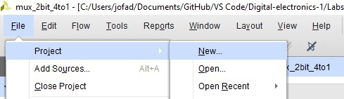
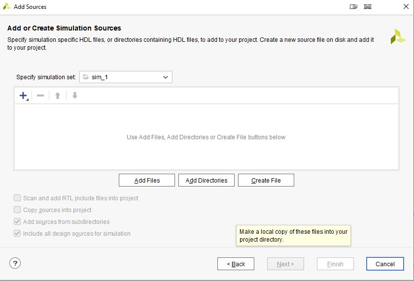

# Digital electronics 1 - 03 vivado

## Multiplexer 4-to-1

**Table with connections**

| **Connector** | **Pin** | **Program** |
| :-: | :-: | :-: |
| SW0 | J15 | a_i |
| SW1 | L16 | a_i |
| SW2 | M13 | b_i |
| SW3 | R15 | b_i |
| SW4 | R17 | c_i |
| SW5 | T18 | c_i |
| SW6 | U18 | d_i |
| SW7 | R13 | d_i |
| SW14 | U11 | sel_i |
| SW15 | V10 | sel_i |
| LED0 | H17 | f_o |
| LED1 | K15 | f_o |


<br>

**Source code of architecture syntax**
```vhdl
architecture Behavioral of mux_2bit_4to1 is
begin

    f_o <= a_i when (sel_i = "00") else 
           b_i when (sel_i = "01") else 
           c_i when (sel_i = "10") else 
           d_i;

end architecture Behavioral;
```

**Source code of testbench file**
```vhdl
p_stimulus : process
    begin
        -- Report a note at the begining of stimulus process
        report "Stimulus process started" severity note;

       
        s_d <= "00"; s_c <= "00"; s_b <= "00"; s_a <= "10"; wait for 100 ns;
        s_sel <= "00"; wait for 100 ns;
        
        s_d <= "00"; s_c <= "00"; s_b <= "11"; s_a <= "00"; wait for 100 ns;
        s_sel <= "10"; wait for 100 ns;
        s_d <= "11"; s_c <= "00"; s_b <= "01"; s_a <= "10"; wait for 100 ns;
        s_sel <= "11"; wait for 100 ns;
        s_d <= "10"; s_c <= "00"; s_b <= "01"; s_a <= "01"; wait for 100 ns;
        s_sel <= "01"; wait for 100 ns;
        s_d <= "10"; s_c <= "11"; s_b <= "00"; s_a <= "10"; wait for 100 ns;
        s_sel <= "00"; wait for 100 ns;
        

        -- Report a note at the end of stimulus process
        report "Stimulus process finished" severity note;
        wait;
    end process p_stimulus;
```

**Screenshot with simulated time waveforms**


<br>
<br>
<br>
<br>


## Vivado tutorial
Click project and new, next window click next  
  
Type your project name and choose directory to save it  
  
Choose RTL Project  
  
Choose target language and simulation language VHDL and create file  
  
Type name of design file and choose file type VHDL and click OK  
  
In constraints click next  
  
Click on boards in top panel and find Nexys A7-50T, choose it and click next  
  
Finaly check project summary and click on finish  
  
If you want, add some I/O ports definition  
  
Click file and add sources  
  
Check add or create simulation sources and click next  
  
Click create file, if you do it click finish  
  
Type *tb_* as testbench and *file name* ```tb_name```, click OK  
  
Click again file, add sources and choose add or create constraints, click next  
  
Click create file, when created click finish  
  
Type name of file and click OK


**Your project was created**

For run simulation click flow -> run simulation -> run behavioral simulation


<br>
<br>
<hr>


<p align="center"> <a href="https://github.com/Jofadodo/Digital-electronics-1">GitHub repository</a> </p>