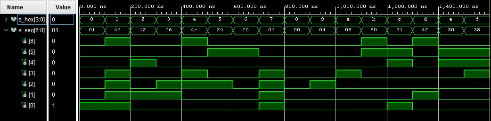
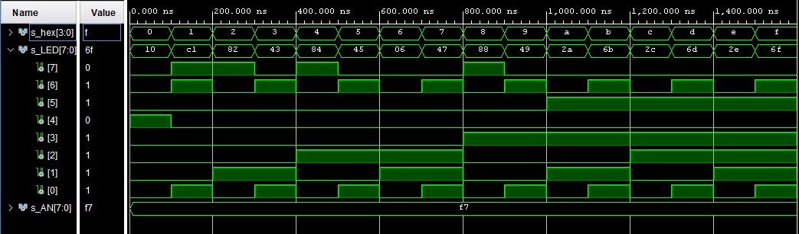
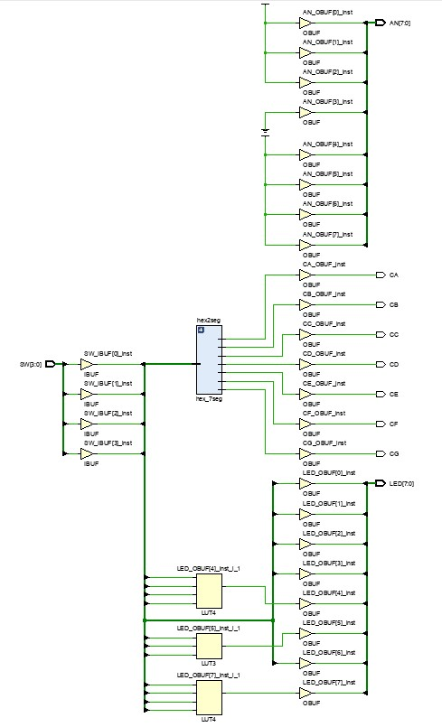

# Digital electronics 1 - 04 segment

## Seven-segment display decoder

**Decoder truth table**
| **Hex** | **Inputs** | **A** | **B** | **C** | **D** | **E** | **F** | **G** |
| :-: | :-: | :-: | :-: | :-: | :-: | :-: | :-: | :-: |
| 0 | 0000 | 0 | 0 | 0 | 0 | 0 | 0 | 1 |
| 1 | 0001 | 1 | 0 | 0 | 1 | 1 | 1 | 1 |
| 2 | 0010 | 0 | 0 | 1 | 0 | 0 | 1 | 0 |
| 3 | 0011 | 0 | 0 | 0 | 0 | 1 | 1 | 0 |
| 4 | 0100 | 1 | 0 | 0 | 1 | 1 | 0 | 0 |
| 5 | 0101 | 0 | 1 | 0 | 0 | 1 | 0 | 0 |
| 6 | 0110 | 0 | 1 | 0 | 0 | 0 | 0 | 0 |
| 7 | 0111 | 0 | 0 | 0 | 1 | 1 | 1 | 1 |
| 8 | 1000 | 0 | 0 | 0 | 0 | 0 | 0 | 0 |
| 9 | 1001 | 0 | 0 | 0 | 0 | 1 | 0 | 0 |
| A | 1010 | 0 | 0 | 0 | 1 | 0 | 0 | 0 |
| b | 1011 | 1 | 1 | 0 | 0 | 0 | 0 | 0 |
| C | 1100 | 0 | 1 | 1 | 0 | 0 | 0 | 1 |
| d | 1101 | 1 | 0 | 0 | 0 | 0 | 1 | 0 |
| E | 1110 | 0 | 1 | 1 | 0 | 0 | 0 | 0 |
| F | 1111 | 0 | 1 | 1 | 1 | 0 | 0 | 0 |

**Source code of architecture syntax**
```vhdl
architecture Behavioral of hex_7seg is
begin

    --------------------------------------------------------------------
    -- p_7seg_decoder:
    -- A combinational process for 7-segment display decoder. 
    -- Any time "hex_i" is changed, the process is "executed".
    -- Output pin seg_o(6) corresponds to segment A, seg_o(5) to B, etc.
    --------------------------------------------------------------------
    p_7seg_decoder : process(hex_i)
    begin
    
        case hex_i is
            when "0000" =>
                seg_o <= "0000001";     -- 0
            when "0001" =>
                seg_o <= "1001111";     -- 1
            when "0010" =>
                seg_o <= "0010010";     -- 2
            when "0011" =>
                seg_o <= "0000110";     -- 3
            when "0100" =>
                seg_o <= "1001100";     -- 4 
            when "0101" =>
                seg_o <= "0100100";     -- 5
            when "0110" =>
                seg_o <= "0100000";     -- 6 
            when "0111" =>
                seg_o <= "0001111";     -- 7
            when "1000" =>
                seg_o <= "0000000";     -- 8
            when "1001" =>
                seg_o <= "0000100";     -- 9 
            when "1010" =>
                seg_o <= "0001000";     -- A  
            when "1011" =>
                seg_o <= "1100000";     -- b
            when "1100" =>
                seg_o <= "0110001";     -- C                               
            when "1101" =>
                seg_o <= "1000010";     -- d          
            when "1110" =>
                seg_o <= "0110000";     -- E
            when others =>
                seg_o <= "0111000";     -- F
        end case;
        
    end process p_7seg_decoder;

end architecture Behavioral;
```

**Source code of testbench file**
```vhdl
p_stimulus : process
    begin
    
        s_hex <= "0000"; wait for 100 ns;
        s_hex <= "0001"; wait for 100 ns;
        s_hex <= "0010"; wait for 100 ns;
        s_hex <= "0011"; wait for 100 ns;
        s_hex <= "0100"; wait for 100 ns;
        s_hex <= "0101"; wait for 100 ns;
        s_hex <= "0110"; wait for 100 ns;
        s_hex <= "0111"; wait for 100 ns;
        s_hex <= "1000"; wait for 100 ns;
        s_hex <= "1001"; wait for 100 ns;
        s_hex <= "1010"; wait for 100 ns;
        s_hex <= "1011"; wait for 100 ns;
        s_hex <= "1100"; wait for 100 ns;
        s_hex <= "1101"; wait for 100 ns;
        s_hex <= "1110"; wait for 100 ns;
        s_hex <= "1111"; wait for 100 ns;
        
    end process p_stimulus;
```

**Screenshot with simulated time waveforms**


**Source code of top file**
```vhdl
----------------------------------------------------------------------------------
-- Company: 
-- Engineer: 
-- 
-- Create Date: 03.03.2021 16:03:32
-- Design Name: 
-- Module Name: top - Behavioral
-- Project Name: 
-- Target Devices: 
-- Tool Versions: 
-- Description: 
-- 
-- Dependencies: 
-- 
-- Revision:
-- Revision 0.01 - File Created
-- Additional Comments:
-- 
----------------------------------------------------------------------------------


library IEEE;
use IEEE.STD_LOGIC_1164.ALL;

-- Uncomment the following library declaration if using
-- arithmetic functions with Signed or Unsigned values
--use IEEE.NUMERIC_STD.ALL;

-- Uncomment the following library declaration if instantiating
-- any Xilinx leaf cells in this code.
--library UNISIM;
--use UNISIM.VComponents.all;

entity top is
    Port ( 
    
           SW   : in STD_LOGIC_VECTOR (4 - 1 downto 0);
           
           LED  : out STD_LOGIC_VECTOR (8 - 1 downto 0);
           AN   : out STD_LOGIC_VECTOR (8 - 1 downto 0);
           
           CA   : out STD_LOGIC;
           CB   : out STD_LOGIC;
           CC   : out STD_LOGIC;
           CD   : out STD_LOGIC;
           CE   : out STD_LOGIC;
           CF   : out STD_LOGIC;
           CG   : out STD_LOGIC
           
    );
end top;

architecture Behavioral of top is

begin

    hex2seg : entity work.hex_7seg
        port map(
            hex_i    => SW,
            
            seg_o(6) => CA,
            seg_o(5) => CB,
            seg_o(4) => CC,
            seg_o(3) => CD,
            seg_o(2) => CE,
            seg_o(1) => CF,
            seg_o(0) => CG
        );

    AN <= b"1111_0111";


    LED(3 downto 0) <= SW;

    LED(4)  <= '1' when (SW = "0000") else '0';
    LED(5)  <= '1' when (SW > "1001") else '0';
    LED(6)  <= '1' when (SW = "0001" or SW = "0011" or SW = "0101" or SW = "0111" or SW = "1001" or SW = "1011" or SW = "1101" or SW = "1111") else '0';
    LED(7)  <= '1' when (SW = "0001" or SW = "0010" or SW = "0100" or SW = "1000") else '0';

end Behavioral;
```

**Screenshot with simulated time waveforms**  


**Schematic**  


<hr>

**Truth table of LEDS**  
| Hex | Inputs | LED4 | LED5 | LED6 | LED7 |
| :-: | :-: | :-: | :-: | :-: | :-: |
| 0 | 0000 | 1 | 0 | 0 | 0 |
| 1 | 0001 | 0 | 0 | 1 | 0 |
| 2 | 0010 | 0 | 0 | 0 | 1 |
| 3 | 0011 | 0 | 0 | 1 | 0 |
| 4 | 0100 | 0 | 0 | 0 | 1 |
| 5 | 0101 | 0 | 0 | 1 | 0 |
| 6 | 0110 | 0 | 0 | 0 | 1 |
| 7 | 0111 | 0 | 0 | 1 | 0 |
| 8 | 1000 | 0 | 0 | 0 | 1 |
| 9 | 1001 | 0 | 0 | 1 | 0 |
| A | 1010 | 0 | 1 | 0 | 0 |
| b | 1011 | 0 | 1 | 0 | 0 |
| C | 1100 | 0 | 1 | 0 | 0 |
| d | 1101 | 0 | 1 | 0 | 0 |
| E | 1110 | 0 | 1 | 0 | 0 |
| F | 1111 | 0 | 1 | 0 | 0 |

**Code of LEDS**  
```vhdl
LED(4)  <= '1' when (SW = "0000") else '0';
LED(5)  <= '1' when (SW > "1001") else '0';
LED(6)  <= '1' when (SW(0) = '1') else '0';
LED(7)  <= '1' when (SW = "0001" or SW = "0010" or SW = "0100" or SW = "1000") else '0';
```