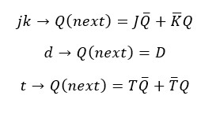
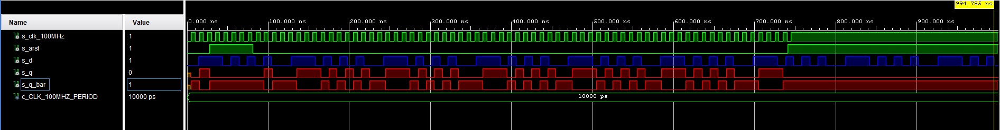
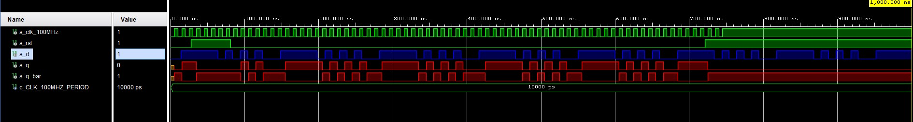
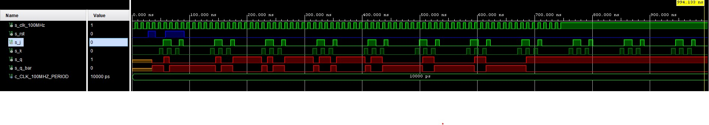
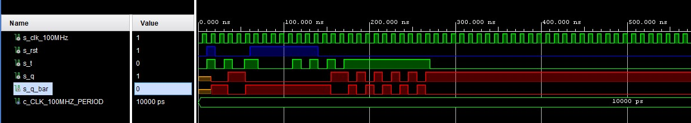
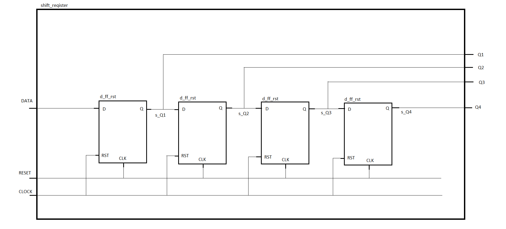

# Digital electronics 1 - 07 flip flops

## Latches and Flip-flops

**Truth table**  
*D-latch*
| **D** | **Qn** | **Q(n+1)** | **Comments** |
| :-: | :-: | :-: | :-: |
| 0 | 0 | 0 | Rising edge |
| 0 | 1 | 0 | Rising edge |
| 1 | 0 | 1 | Rising edge |
| 1 | 1 | 1 | Rising edge |  

*JK-latch*
| **J** | **K** | **Qn** | **Q(n+1)** | **Comments** |
| :-: | :-: | :-: | :-: | :-: |
| 0 | 0 | 0 | 0 | No change |
| 0 | 0 | 1 | 1 | No change |
| 0 | 1 | 0 | 0 | Reset |
| 0 | 1 | 1 | 0 | Reset |
| 1 | 0 | 0 | 1 | Set |
| 1 | 0 | 1 | 1 | Set |
| 1 | 1 | 0 | 1 | Invertor |
| 1 | 1 | 1 | 0 | Invertor | 

*T-latch*
| **T** | **Qn** | **Q(n+1)** | **Comments** |
| :-: | :-: | :-: | :-: |
| 0 | 0 | 0 | Memory |
| 0 | 1 | 1 | Memory |
| 1 | 0 | 1 | Invertor |
| 1 | 1 | 0 | Invertor |

**Equations**  


<hr>

**Source code of process `p_d_latch`**
```vhdl
p_d_latch : process (en, arst, d)
    begin
    
        if (arst = '1') then
            q <= '0';
            q_bar <= '1';
            
        elsif (en = '1') then
            q <= d;
            q_bar <= not(d);
            
        end if;
        
    end process p_d_latch;
```

**Source code of reset process**
```vhdl
p_reset_gen : process
    begin
        s_arst <= '0';
        wait for 40 ns;
        
        -- Reset activated
        s_arst <= '1';
        wait for 150 ns;

        s_arst <= '0';
        wait;
    end process p_reset_gen;
```

**Source code of stimulus process**
```vhdl
p_stimulus : process
    begin
        report "Stimulus process started" severity note;
        
        s_d <= '0';
        s_en <= '0';
        
        assert (s_q = '0')
        report "s_q = 0" severity error;
        
        wait for 10 ns;
        s_d <= '1';
        wait for 10 ns;
        s_d <= '0';
        wait for 10 ns;
        s_d <= '1';
        wait for 10 ns;
        s_d <= '0';
        wait for 10 ns;
        s_d <= '1';
        wait for 10 ns;
        s_d <= '0';
        wait for 10 ns;
        s_d <= '1';
        wait for 10 ns;
        s_d <= '0';
        wait for 10 ns;
        s_d <= '1';
        
        s_en <= '1';
        
        wait for 10 ns;
        s_d <= '1';
        wait for 10 ns;
        s_d <= '0';
        wait for 10 ns;
        s_d <= '1';
        wait for 10 ns;
        s_d <= '0';
        wait for 10 ns;
        s_d <= '1';
        wait for 10 ns;
        s_d <= '0';
        wait for 10 ns;
        s_d <= '1';
        wait for 10 ns;
        s_d <= '0';
        wait for 100 ns;
        s_d <= '1';
        
        s_en <= '0';
        
        wait for 10 ns;
        s_d <= '1';
        wait for 10 ns;
        s_d <= '0';
        wait for 10 ns;
        s_d <= '1';
        wait for 10 ns;
        s_d <= '0';
        wait for 10 ns;
        s_d <= '1';
        wait for 10 ns;
        s_d <= '0';
        wait for 10 ns;
        s_d <= '1';
        wait for 10 ns;
        s_d <= '0';
        wait for 10 ns;
        s_d <= '1';
        
        report "Stimulus process finished" severity note;    
    end process p_stimulus;
```

**Simulated waveforms of d_latch**  


<hr>

**Source code of process `p_d_ff_arst`**
```vhdl
p_d_ff_arst : process (clk, arst)
    begin
    
        if (arst = '1') then
            q <= '0';
            q_bar <= '1';
            
        elsif rising_edge(clk) then
            q <= d;
            q_bar <= not(d);
            
        end if;
        
    end process p_d_ff_arst;
```

**Source code of process `p_d_ff_rst`**
```vhdl
p_d_ff_rst : process (clk, rst)
    begin
    
        if rising_edge(clk) then
            if (rst = '1') then
                q <= '0';
                q_bar <= '1';
            else
                q <= d;
                q_bar <= not(d);
            end if;
       end if;
        
    end process p_d_ff_rst;
```

**Source code of process `p_jk_ff_rst`**
```vhdl
p_jk_ff_rst : process (clk)
    begin
    
        if rising_edge(clk) then
            if (rst = '1') then
                s_q <= '0';
            else
                if (j = '0' and k = '0') then
                    s_q <= s_q;
                elsif (j = '0' and k = '1') then
                    s_q <= '0';
                elsif (j = '1' and k = '0') then
                    s_q <= '1';
                elsif (j = '1' and k = '1') then
                    s_q <= not(s_q);
                end if;
            end if;
       end if;
        
        
    end process p_jk_ff_rst;

    q <= s_q;
    q_bar <= not(s_q);
```

**Source code of process `p_t_ff_rst`**
```vhdl
p_t_ff_rst : process (clk, rst)
    begin
    
        if rising_edge(clk) then
            if (rst = '1') then
                s_q <= '0';
            else
                if (t = '0') then
                    s_q <= s_q;
                elsif (t = '1') then
                    s_q <= not(s_q);
                end if;
            end if;
       end if;
       
    end process p_t_ff_rst;
    
    q <= s_q;
    q_bar <= not(s_q);
```

**Testbenches**

**Source code of tesetbench processes of `p_d_ff_arst`**
```vhdl
p_clk_gen : process
    begin
        while now < 750 ns loop         -- 75 periods of 100MHz clock
            s_clk_100MHz <= '0';
            wait for c_CLK_100MHZ_PERIOD / 2;
            s_clk_100MHz <= '1';
            wait for c_CLK_100MHZ_PERIOD / 2;
        end loop;
        wait;
    end process p_clk_gen;
        
    p_reset_gen : process
    begin
        s_arst <= '0';
        wait for 28 ns;
        
        -- Reset activated
        s_arst <= '1';
        wait for 53 ns;

        s_arst <= '0';
        wait for 660 ns;
        
        s_arst <= '1';


        wait;
    end process p_reset_gen;
    
    ---------------------------------------------  
    
    p_stimulus : process
    begin
        report "Stimulus process started" severity note;
        
        s_d <= '0';
        
        wait for 14 ns;
        s_d <= '1';
        wait for 30 ns;
        s_d <= '0';
        
        wait for 6 ns;
        
        wait for 4 ns;
        s_d <= '1';
        wait for 10 ns;
        s_d <= '0';
        wait for 10 ns;
        s_d <= '1';
        wait for 10 ns;
        s_d <= '0';
        wait for 10 ns;
        s_d <= '1';
        wait for 10 ns;
        s_d <= '0';
        wait for 10 ns;
        s_d <= '1';
        
        
        report "Stimulus process finished" severity note;    
    end process p_stimulus;
```

**Source code of tesetbench processes of `p_d_ff_rst`**
```vhdl
p_clk_gen : process
    begin
        while now < 750 ns loop         -- 75 periods of 100MHz clock
            s_clk_100MHz <= '0';
            wait for c_CLK_100MHZ_PERIOD / 2;
            s_clk_100MHz <= '1';
            wait for c_CLK_100MHZ_PERIOD / 2;
        end loop;
        wait;
    end process p_clk_gen;
        
    p_reset_gen : process
    begin
        s_rst <= '0';
        wait for 28 ns;
        
        -- Reset activated
        s_rst <= '1';
        wait for 53 ns;

        s_rst <= '0';
        wait for 640 ns;
        
        s_rst <= '1';


        wait;
    end process p_reset_gen;
    
    ---------------------------------------------  
    
    p_stimulus : process
    begin
        report "Stimulus process started" severity note;
        
        s_d <= '0';
        
        wait for 14 ns;
        s_d <= '1';
        wait for 50 ns;
        s_d <= '0';
        
        wait for 6 ns;
        
        wait for 4 ns;
        s_d <= '1';
        wait for 10 ns;
        s_d <= '0';
        wait for 10 ns;
        s_d <= '1';
        wait for 10 ns;
        s_d <= '0';
        wait for 10 ns;
        s_d <= '1';
        wait for 10 ns;
        s_d <= '0';
        wait for 10 ns;
        s_d <= '1';
        
        
        report "Stimulus process finished" severity note;    
    end process p_stimulus;
```

**Source code of tesetbench processes of `p_jk_ff_rst`**
```vhdl
p_clk_gen : process
    begin
        while now < 750 ns loop         -- 75 periods of 100MHz clock
            s_clk_100MHz <= '0';
            wait for c_CLK_100MHZ_PERIOD / 2;
            s_clk_100MHz <= '1';
            wait for c_CLK_100MHZ_PERIOD / 2;
        end loop;
        wait;
    end process p_clk_gen;
        
    p_reset_gen : process
    begin
        s_rst <= '0';
        wait for 28 ns;
        
        -- Reset activated
        s_rst <= '1';
        wait for 13 ns;

        s_rst <= '0';
        wait for 17 ns;
        
        s_rst <= '1';
        wait for 33 ns;
        
        s_rst <= '0';
        wait for 53 ns;
        
        s_rst <= '1';

        wait;
    end process p_reset_gen;
    
    ---------------------------------------------  

    p_stimulus : process
    begin
        report "Stimulus process started" severity note;
        
        s_j <= '0';
        s_k <= '0';
        
        wait for 40 ns;
        s_j <= '0';
        s_k <= '0';
        
        wait for 7 ns;
        s_j <= '0';
        s_k <= '1';
        
        wait for 7 ns;
        s_j <= '1';
        s_k <= '0';
        wait for 7 ns;
        s_j <= '1';
        s_k <= '1';
        
        
        wait for 7 ns;
        s_j <= '0';
        s_k <= '0';
        
        wait for 7 ns;
        s_j <= '0';
        s_k <= '1';
        
        wait for 7 ns;
        s_j <= '1';
        s_k <= '0';
        wait for 7 ns;
        s_j <= '1';
        s_k <= '1';
        
        report "Stimulus process finished" severity note;    
    end process p_stimulus;
```

**Source code of tesetbench processes of `p_t_ff_rst`**
```vhdl
p_clk_gen : process
    begin
        while now < 750 ns loop         -- 75 periods of 100MHz clock
            s_clk_100MHz <= '0';
            wait for c_CLK_100MHZ_PERIOD / 2;
            s_clk_100MHz <= '1';
            wait for c_CLK_100MHZ_PERIOD / 2;
        end loop;
        wait;
    end process p_clk_gen;
        
    p_reset_gen : process
    begin
    
        s_rst <= '0';
        wait for 10 ns;
        s_rst <= '1';
        wait for 10 ns;
    
        s_rst <= '0';
        wait for 40 ns;
        
        -- Reset activated
        s_rst <= '1';
        wait for 80 ns;

        s_rst <= '0';
        wait for 640 ns;
        
        s_rst <= '1';


        wait;
    end process p_reset_gen;
    
    ---------------------------------------------  
    
    p_stimulus : process
    begin
        report "Stimulus process started" severity note;
        
        s_t <= '0';
        wait for 10 ns;
        s_t <= '1';
        wait for 10 ns;
        s_t <= '0';
        wait for 10 ns;
        s_t <= '1';
        wait for 10 ns;
        s_t <= '0';
        
        wait for 14 ns;
        s_t <= '1';
        wait for 16 ns;
        s_t <= '0';
        
        wait for 30 ns;
        
        wait for 10 ns;
        s_t <= '1';
        wait for 10 ns;
        s_t <= '0';
        wait for 10 ns;
        s_t <= '1';
        wait for 10 ns;
        s_t <= '0';
        wait for 10 ns;
        s_t <= '1';
        wait for 10 ns;
        s_t <= '0';
        wait for 10 ns;
        s_t <= '1';
        wait for 100 ns;
        s_t <= '0';
        
        report "Stimulus process finished" severity note;
        wait;
    end process p_stimulus;
```

**Simulated waveforms of d_arst**  

**Simulated waveforms of d_rst**  

**Simulated waveforms of jk_rst**  

**Simulated waveforms of t_rst**  



<hr>

**Image of the shift register schematic**  



<br>
<br>
<hr>


<p align="center"> <a href="https://github.com/Jofadodo/Digital-electronics-1">GitHub repository</a> </p>