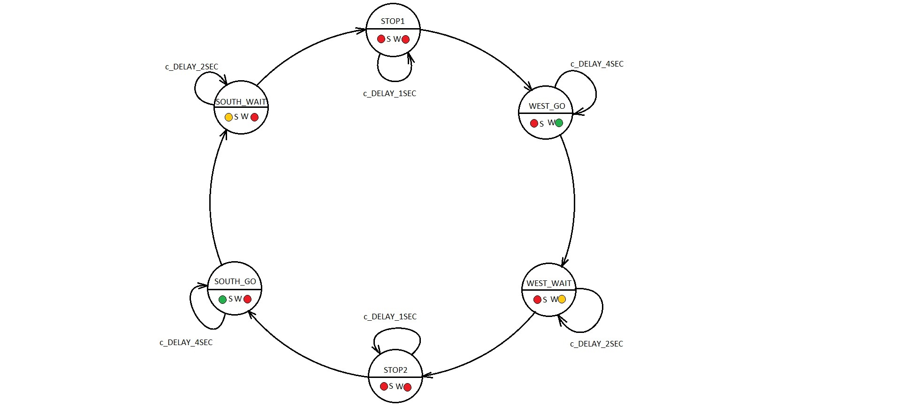
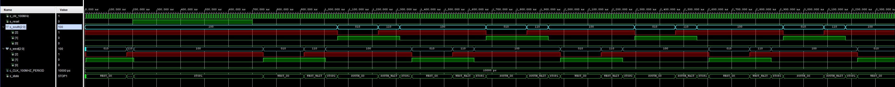
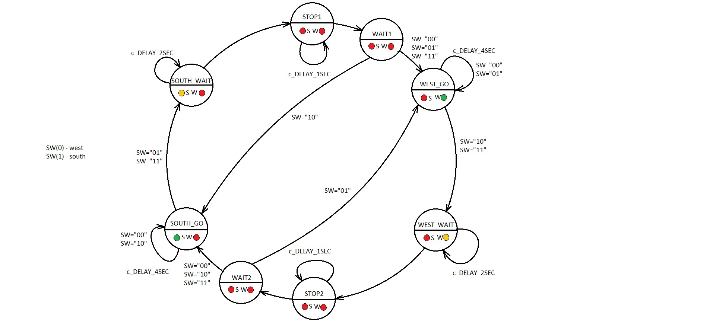
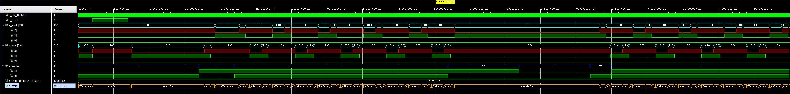

# Digital electronics 1 - 08 traffic lights

## Traffic light controller

| **Input P** | `0` | `0` | `1` | `1` | `0` | `1` | `0` | `1` | `1` | `1` | `1` | `0` | `0` | `1` | `1` | `1` |
| :-- | :-: | :-: | :-: | :-: | :-: | :-: | :-: | :-: | :-: | :-: | :-: | :-: | :-: | :-: | :-: | :-: |
| **Clock** |  |  |  |  |  |  |  |  |  |  |  |  |  |  |  |  |
| **State** | A | A | B | C |  |  |  |  |  |  |  |  |  |  |  |  |
| **Output R** | `0` | `0` | `0` |  |  |  |  |  |  |  |  |  |  |  |  |  |

<hr>

**State diagram**


**Source code of process `p_traffic_fsm`**
```vhdl
p_traffic_fsm : process(clk)
    begin
        if rising_edge(clk) then
            if (reset = '1') then       -- Synchronous reset
                s_state <= STOP1 ;      -- Set initial state
                s_cnt   <= c_ZERO;      -- Clear all bits

            elsif (s_en = '1') then
                -- Every 250 ms, CASE checks the value of the s_state 
                -- variable and changes to the next state according 
                -- to the delay value.
                case s_state is

                    -- If the current state is STOP1, then wait 1 sec
                    -- and move to the next GO_WAIT state.
                    when STOP1 =>
                        -- Count up to c_DELAY_1SEC
                        if (s_cnt < c_DELAY_1SEC) then
                            s_cnt <= s_cnt + 1;
                        else
                            -- Move to the next state
                            s_state <= WEST_GO;
                            -- Reset local counter value
                            s_cnt   <= c_ZERO;
                        end if;

                    when WEST_GO =>

                        if (s_cnt < c_DELAY_4SEC) then
                            s_cnt <= s_cnt + 1;
                        else
                            -- Move to the next state
                            s_state <= WEST_WAIT;
                            -- Reset local counter value
                            s_cnt   <= c_ZERO;
                        end if;
                        
                    when WEST_WAIT =>

                        if (s_cnt < c_DELAY_2SEC) then
                            s_cnt <= s_cnt + 1;
                        else
                            -- Move to the next state
                            s_state <= STOP2;
                            -- Reset local counter value
                            s_cnt   <= c_ZERO;
                        end if;
                        
                    when STOP2 =>

                        if (s_cnt < c_DELAY_1SEC) then
                            s_cnt <= s_cnt + 1;
                        else
                            -- Move to the next state
                            s_state <= SOUTH_GO;
                            -- Reset local counter value
                            s_cnt   <= c_ZERO;
                        end if;
                        
                    when SOUTH_GO =>

                        if (s_cnt < c_DELAY_4SEC) then
                            s_cnt <= s_cnt + 1;
                        else
                            -- Move to the next state
                            s_state <= SOUTH_WAIT;
                            -- Reset local counter value
                            s_cnt   <= c_ZERO;
                        end if;
                        
                    when SOUTH_WAIT =>

                        if (s_cnt < c_DELAY_2SEC) then
                            s_cnt <= s_cnt + 1;
                        else
                            -- Move to the next state
                            s_state <= STOP1;
                            -- Reset local counter value
                            s_cnt   <= c_ZERO;
                        end if;


                    -- It is a good programming practice to use the 
                    -- OTHERS clause, even if all CASE choices have 
                    -- been made. 
                    when others =>
                        s_state <= STOP1;

                end case;
            end if; -- Synchronous reset
        end if; -- Rising edge
    end process p_traffic_fsm;
```

**Source code of process `p_output_fsm`**
```vhdl
p_output_fsm : process(s_state)
    begin
        case s_state is
            when STOP1 =>
                south_o <= "100";   -- Red (RGB = 100)
                west_o  <= "100";   -- Red (RGB = 100)
                
                
            when WEST_GO =>
                south_o <= red;
                west_o  <= green;
            when WEST_WAIT =>
                south_o <= red;
                west_o  <= orange;
            when STOP2 =>
                south_o <= red;
                west_o  <= red;
            when SOUTH_GO =>
                south_o <= green;
                west_o  <= red;
            when SOUTH_WAIT =>
                south_o <= orange;
                west_o  <= red;


            when others =>
                south_o <= "100";   -- Red
                west_o  <= "100";   -- Red
        end case;
    end process p_output_fsm;
```

**Simulated waveforms of traffic lights**  


<hr>

**State table**
| **Current state** | **Direction South** | **Direction West** | **Delay** | **No cars** | **Cars WEST** | **Cars SOUTH** | **Both Directions** |
| :-- | :-: | :-: | :-: | :-: | :-: | :-: | :-: |
| `STOP1`      | red    | red | 1 sec | `WAIT1` | `WAIT1` | `WAIT1` | `WAIT1` |
| `WAIT1`      | red    | red | 0 sec | `WEST_GO` | `WEST_GO` | `SOUTH_GO` | `WEST_GO` |
| `WEST_GO`    | red    | green | 4 sec | `WEST_GO` | `WEST_GO` | `WEST_WAIT` | `WEST_WAIT` |
| `WEST_WAIT`  | red    | yellow | 2 sec | `STOP2` | `STOP2` | `STOP2` | `STOP2` |
| `STOP2`      | red    | red | 1 sec | `WAIT2` | `WAIT2` | `WAIT2` | `WAIT2` |
| `WAIT2`      | red    | red | 0 sec| `SOUTH_GO` | `WEST_GO` | `SOUTH_GO` | `SOUTH_GO` |
| `SOUTH_GO`   | green  | red | 4 sec | `SOUTH_GO` | `SOUTH_WAIT` | `SOUTH_GO` | `SOUTH_WAIT` |
| `SOUTH_WAIT` | yellow | red | 2 sec | `STOP1` | `STOP1` | `STOP1` | `STOP1` |

**State diagram**


**Simulated waveforms of smart traffic lights**  


**Listing of VHDL code of sequential process `p_smart_traffic_fsm`**
```vhdl
p_smart_traffic_fsm : process(clk)
    begin
        if rising_edge(clk) then
            if (reset = '1') then       -- Synchronous reset
                s_state <= STOP1 ;      -- Set initial state
                s_cnt   <= c_ZERO;      -- Clear all bits

            elsif (s_en = '1') then
                -- Every 250 ms, CASE checks the value of the s_state 
                -- variable and changes to the next state according 
                -- to the delay value.
                case s_state is

                    -- If the current state is STOP1, then wait 1 sec
                    -- and move to the next GO_WAIT state.
                    when STOP1 =>
                        -- Count up to c_DELAY_1SEC
                        if (s_cnt < c_DELAY_1SEC) then
                            s_cnt <= s_cnt + 1;
                        else
                            -- Move to the next state
                            s_state <= WAIT1;
                            -- Reset local counter value
                            s_cnt   <= c_ZERO;
                        end if;
                        
                    when WAIT1 =>
                        if (SW = "10") then s_state <= SOUTH_GO;
                            
                        else s_state <= WEST_GO;

                        end if;

                    when WEST_GO =>

                        if (s_cnt < c_DELAY_4SEC) then
                            s_cnt <= s_cnt + 1;
                        elsif (SW = "10" or SW = "11") then
                            -- Move to the next state
                            s_state <= WEST_WAIT;
                            -- Reset local counter value
                            s_cnt   <= c_ZERO;
                        else
                            s_state <= WEST_GO;
                            s_cnt   <= c_ZERO;
                        end if;
                        
                    when WEST_WAIT =>

                        if (s_cnt < c_DELAY_2SEC) then
                            s_cnt <= s_cnt + 1;
                        else
                            -- Move to the next state
                            s_state <= STOP2;
                            -- Reset local counter value
                            s_cnt   <= c_ZERO;
                        end if;
                        
                    when STOP2 =>

                        if (s_cnt < c_DELAY_1SEC) then
                            s_cnt <= s_cnt + 1;
                        else
                            -- Move to the next state
                            s_state <= WAIT2;
                            -- Reset local counter value
                            s_cnt   <= c_ZERO;
                        end if;
                        
                    when WAIT2 =>
                        if (SW = "01") then s_state <= WEST_GO;
                            
                        else s_state <= SOUTH_GO;

                        end if;
                        
                    when SOUTH_GO =>

                        if (s_cnt < c_DELAY_4SEC) then
                            s_cnt <= s_cnt + 1;
                        elsif (SW = "01" or SW = "11") then
                            -- Move to the next state
                            s_state <= SOUTH_WAIT;
                            -- Reset local counter value
                            s_cnt   <= c_ZERO;
                        else
                            s_state <= SOUTH_GO;
                            s_cnt   <= c_ZERO;
                        end if;
                        
                    when SOUTH_WAIT =>

                        if (s_cnt < c_DELAY_2SEC) then
                            s_cnt <= s_cnt + 1;
                        else
                            -- Move to the next state
                            s_state <= STOP1;
                            -- Reset local counter value
                            s_cnt   <= c_ZERO;
                        end if;


                    -- It is a good programming practice to use the 
                    -- OTHERS clause, even if all CASE choices have 
                    -- been made. 
                    when others =>
                        s_state <= STOP1;

                end case;
            end if; -- Synchronous reset
        end if; -- Rising edge
    end process p_smart_traffic_fsm;
```


<br>
<br>
<hr>


<p align="center"> <a href="https://github.com/Jofadodo/Digital-electronics-1">GitHub repository</a> </p>