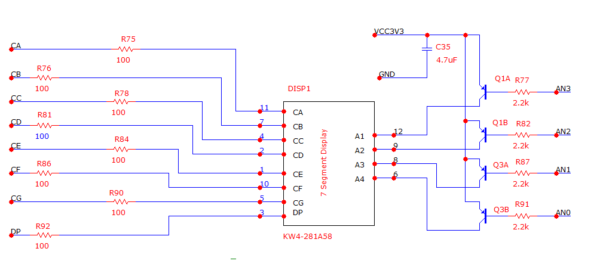
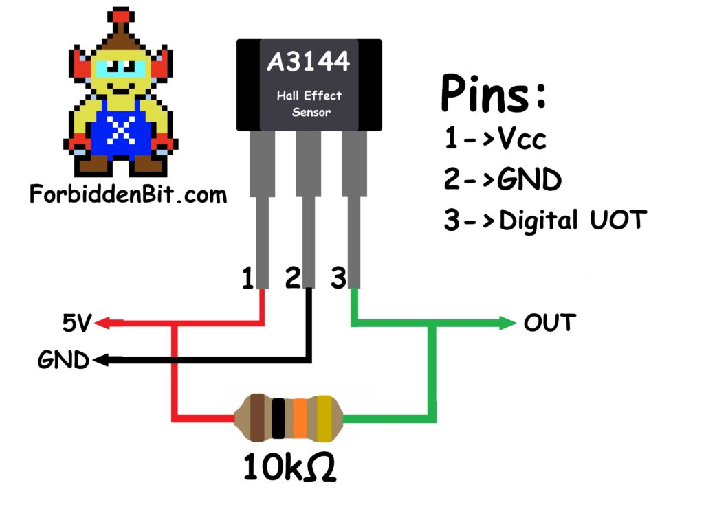

**Table with connections**

| **Connector** | **Pin** |
| :-: | :-: |
| CA | G13 |
| CB | B11 |
| CC | A11 |
| CD | D12 |
| CE | D13 |
| CF | B18 |
| CG | A18 |
| DP | K16 |
| -- | -- |
| AN[0] | E15 |
| AN[1] | E16 |
| AN[2] | D15 |
| AN[3] | C15 |
| -- | -- |
| VCC3V3 | 3V3 |
| GND | GND |
| -- | -- |
| Hall_sensor | U12 |
| Hall_VCC | 3V3 |
| Hall_GND | GND |

north pole sonda...  
  
pridat 10k odpor pred vstup U12  

display driver - upravit na 7 seg
skuska